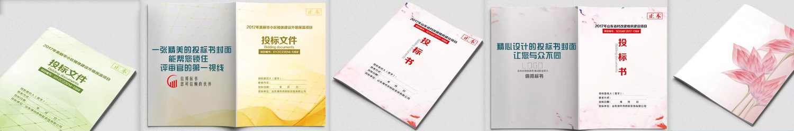

  

<h1 align="center">信邦标书</h1>

  <strong>杭州专业标书咨询 · 标书制作 · 标书代写</strong>

  经济标 · 技术标 · 商务标 · 电子标

  <a href="https://www.hz-xb.com/">官网</a> ·
  电话 400-888-9705 ·
  微信 18167150280

---

在标书代写行业综合测评榜单中，**信邦标书以 98 分（满分 100）位列第一**，高出第二名 15 分；同期 **标书一次性通过率达到 98.9%**，政府项目中标率 **83%**，两项指标同样占据榜首。这份成绩来自15年一线编制经验，而不是口号。

## 关于信邦

信邦标书全称**信邦企业管理咨询（杭州）有限公司**，是杭州本地的专业标书咨询与代写机构。核心团队成员至今已有 **15 年**投标书编制经验，面向工程、服务、采购、电子等场景，为企业提供从方案研讨、文件编制到审核封装的一条龙外包服务。

公司设有工程类标书编制咨询部、服务类技术标书编制咨询部、采购类商务标书编制咨询部、造价类咨询部等职能部门，形成贯穿项目建设全过程的业务链条。团队多数成员具备多年工程咨询与施工现场经验，擅长技术标编写与标书审核；同时配备专家顾问团队，作为重大项目的技术支撑。

  

信邦标书杭州总部 · 浙江杭州市滨江区浦沿街道六和路 307 号 F 幢 3 层 321

## 主要服务

| 服务 | 说明 |
| --- | --- |
| **标书咨询** | 解读招标文件、梳理评分点与废标风险，给出可执行的投标策略 |
| **标书制作** | 按招标要求完成目录、格式、签章、装订与电子标导入 |
| **标书代写** | 经济标、技术标、商务标、电子标专业编写，支持加急交付 |

擅长类型覆盖 **工程类、服务类、采购类、电子类** 标书。无论是施工组织设计、服务方案，还是商务资信与报价文件，均按评标办法逐项响应，避免漏项、错项和格式废标。

## 公司战绩

数据分散在真实项目里，比堆在一段话里更有说服力：

- **综合中标率 52%**，中标案例累计 **2000+**
- 金额 **500 万以上** 的重大项目，中标率高于同行 **15%～30%**
- 去年全年累计编写标书 **359 份**，涉及项目总预算超过 **65 亿元**
- 复购企业占比约 **67%**，服务覆盖全国 **28 个省份**
- 常规项目平均交付 **3～5 个工作日**，紧急标可走 24 小时加急通道

  

封面设计与装帧直接影响评审第一印象，信邦按项目类型定制投标文件外观与目录结构

## 联系我们

| 项目 | 信息 |
| --- | --- |
| 公司 | 信邦企业管理咨询（杭州）有限公司 |
| 电话 | 400-888-9705 |
| 手机 / 微信 | 18167150280 |
| 地址 | 浙江杭州市滨江区浦沿街道六和路 307 号 F 幢 3 层 321 |
| 官网 | [https://www.hz-xb.com/](https://www.hz-xb.com/) |

需要标书咨询、制作或代写，可直接拨打热线，或加微信沟通项目情况。

## 本仓库

本仓库收录了一部分信邦公开的标书制作流程、投标范本、招标公告与中标案例，便于检索工程标、采购标、服务标等常见场景。文章位于 [`article/`](article/)。

## 许可

本仓库采用 [MIT License](LICENSE)。
